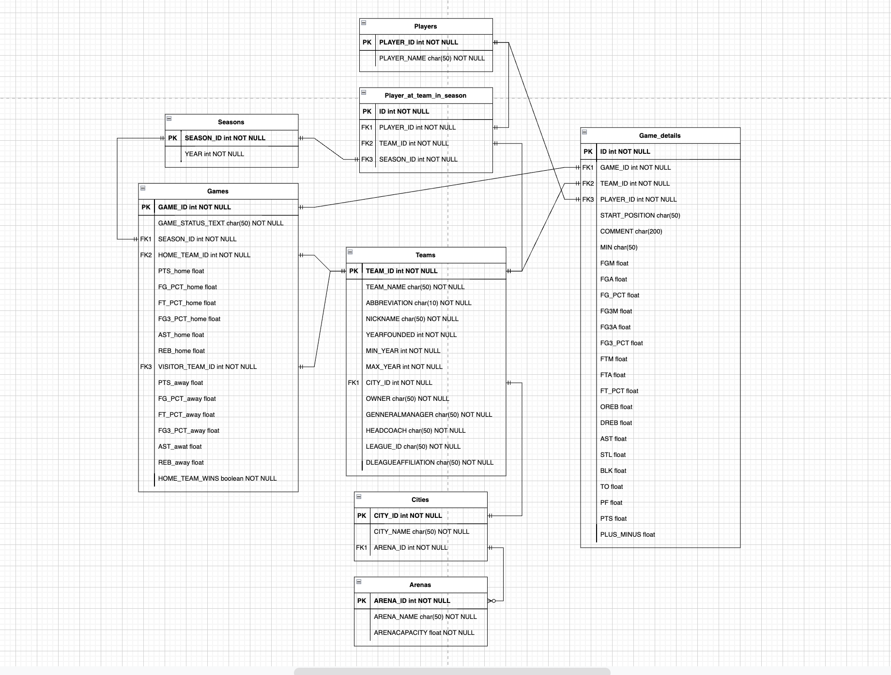

# Instalation 

## Step 1 
We must clone this repository using thsi command and put our zip file where there are all dbs as a zip.
~~~~bash
git clone (url)
sudo unzip data.zip
~~~~

## Step 2
Lets install our requirements to have all utilities for this code.
~~~~~bash
pip3 install -r requirements.txt
~~~~~

## Step 3

In this step we will create a user for mysql and give all attributes for modifications, execution and so on.

```Python
# IMPORTANT TO RUN IN YOUR MYSQL CONSOLE
#pip3 install mysql-connector-python
mysql> CREATE USER 'nuevo_usuario'@'localhost' IDENTIFIED BY 'contraseña';
mysql> GRANT ALL PRIVILEGES ON * . * TO 'nuevo_usuario'@'localhost';
mysql> FLUSH PRIVILEGES;
mysql> exit
# The user and password will be used for the future connection.
#ref: https://www.hostinger.mx/tutoriales/como-crear-usuario-mysql
```
You need to access within Mysql through the console in your computer. After that, you must replace `nuevo_usuario` and `contraseña` in the command to create a new user.

The second command is just for giving all privileges to this new user.

## Step 4

Execute just this command to make it works
~~~~bash
python3 sql.py
~~~~

This will create all the insfrastructure for SQL database and also It will make the insertion as a part of the script to do easier.

# Explanation

## Modules.py

This is the main module to log in and connect with the database, but also is the bridge to connect and to build the infrastructure in order to have all ready for insertion.

We used mysql for python beacuse is easier to keep a connection and also to have a faster response for this kind of things.

~~~~python
#making game table
def game_t(mydb):
    c = mydb.cursor()
    try:
        structure = "GAME_ID int NOT NULL,\
                    GAME_STATUS_TEXT CHAR(50) NOT NULL,\
                    SEASON_ID int NOT NULL,\
                    HOME_TEAM_ID int NOT NULL,\
                    PTS_home float,\
                    FG_PCT_home float,\
                    FT_PCT_home float,\
                    FG3_PCT_home float,\
                    AST_home float,\
                    REB_home float,\
                    VISITOR_TEAM_ID int NOT NULL,\
                    PTS_away float,\
                    FG_PCT_away float,\
                    FT_PCT_away float,\
                    FG3_PCT_away float,\
                    AST_awat float,\
                    REB_away float,\
                    HOME_TEAM_WINS boolean NOT NULL,\
                    PRIMARY KEY (GAME_ID)"
        c.execute(f'CREATE TABLE Games ({structure})')
    except:
        pass
~~~~
This is and example of one table to build the infrastructure and how it was connected through a cursor. However; At the end when all tables have been created we will connect it with this module:

~~~~python

def relations(mydb):
    c = mydb.cursor()
    c.execute('USE NBA_DB')

    #cities relations
    c.execute('ALTER TABLE Cities ADD FOREIGN KEY (ARENA_ID) REFERENCES Arenas(ARENA_ID);')

    #teams relations
    c.execute('ALTER TABLE Teams ADD FOREIGN KEY (CITY_ID) REFERENCES Cities(CITY_ID);')

    #game details relations
    c.execute('ALTER TABLE Game_details ADD FOREIGN KEY (GAME_ID) REFERENCES Games(GAME_ID);')
    c.execute('ALTER TABLE Game_details ADD FOREIGN KEY (TEAM_ID) REFERENCES Teams(TEAM_ID);')
    c.execute('ALTER TABLE Game_details ADD FOREIGN KEY (PLAYER_ID) REFERENCES Players(PLAYER_ID);')

    #games relations
    c.execute('ALTER TABLE Games ADD FOREIGN KEY (SEASON_ID) REFERENCES Seasons(SEASON_ID);')
    c.execute('ALTER TABLE Games ADD FOREIGN KEY (HOME_TEAM_ID) REFERENCES Teams(TEAM_ID);')
    c.execute('ALTER TABLE Games ADD FOREIGN KEY (VISITOR_TEAM_ID) REFERENCES Teams(TEAM_ID);')

    #player at team
    c.execute('ALTER TABLE Players_at_team_in_season ADD FOREIGN KEY (PLAYER_ID) REFERENCES Players(PLAYER_ID);')
    c.execute('ALTER TABLE Players_at_team_in_season ADD FOREIGN KEY (TEAM_ID) REFERENCES Teams(TEAM_ID);')
    c.execute('ALTER TABLE Players_at_team_in_season ADD FOREIGN KEY (SEASON_ID) REFERENCES Seasons(SEASON_ID);')
~~~~

## The design
</img>

# Data cleanning 
In this chapter we just transform all databases into our specifics structures to make a good insertion. That is the reason why all databases after this step will be saved into `data_cleanned` dir.

# Data insertion

This is so simple to explain because this just will be connected to the database through SQL, where you will stablish a new connection for making the insertion.

Example of an insertion:

~~~~python
season_db = pd.read_csv('data_cleanned/season.csv')
    try:
        connection = mysql.connector.connect(host='localhost',
                                            database='NBA_DB',
                                            user=user,
                                            password=password)

        mySql_insert_query = """INSERT INTO Seasons (SEASON_ID, YEAR) 
                            VALUES (%s, %s) """
        
        records_to_insert = season_db.to_numpy().tolist()

        cursor = connection.cursor()
        cursor.executemany(mySql_insert_query, records_to_insert)
        connection.commit()
        print(cursor.rowcount, "Record inserted successfully into Season table")

    except mysql.connector.Error as error:
        print("Failed to insert record into MySQL table {}".format(error))

    finally:
        if connection.is_connected():
            cursor.close()
            connection.close()
            print("MySQL connection is closed")
~~~~

That happend with each database.
